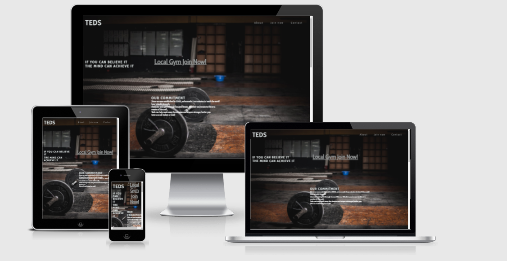

# Purpose of the project

This page represents a newly launched gym named Teds.
On the page, it provides information about the gym's location and its benefits.
People from 16 years and above can join us on the website. 

# user stories

Teds is a website that will be targeted towards people who want to join a great Gym and for those with different schedules in life, accessibility is important because of 24 hours open time.
On the website you will find a motivation qoute, open times, price per month, address and form to signing up and Address and contact information for further questions.

### Features
- __Navigation Bar__
  * The navigation bar is fully responsive, allowing users to navigate easily from Logo, About, Join Now, and Contact all on one page.
  * By using this section, the user can easily navigate between sections across all devices without having to switch back to the previous one.
  * The underline highlight the section where you are.

- __first section image and Header__
- The gym pictures on this page illustrate what this page is all about.
- The wake up call quotes that motivate people.
- Making it look simple is the first step for that is all it takes. 
 

- __About section__
- A very experienced owner owns this gym, which has just opened its doors.
- The top reasons not to go to another gym but this one.
- Accessible 24 hours a day.
  

- __Join Now__
- A great opportunity to join us now.
- To submit, all fields must be filled out.
- Hover over the borderline and a red color will indicate what field you're on.
- The submit button is highlighted in red and white text.

- __Contact and Address__
- There is an address for where the facility is located, as well as an e-mail and phone number.
- The hours during which manned operators are available.
- Follow us on social media or look for inspiration with this big social icon.

- __Features implement__
- Picture gallery with inspiring quotes along with the pictures.
- An online booking system to book training sessions.

# Testing

- I tested this side on Microsoft edge and Chrome and it seems to works great.
- The page is viewable on desktops, iPads, and phones when I tested.
- I can confirmed All sections such as the navigation bar, logo, about and join now section are operational and easy to use.
- I verified that the Join Now form works and I made sure all entries were required to be submitted.

- __Bugs__
- When targeting the icon element, I tried different code because it was very small and had purple color.

- When I turned to Google, I found how to solve the problem
- solving with this  worked fine

# Validator Testing 
## HTML
- No Error on the official [w3c](https://validator.w3.org/nu/?doc=https%3A%2F%2Fblandaren123.github.io%2FTeds-gym%2F)
## CSS
- No Error on the official [jigsaw](https://jigsaw.w3.org/css-validator/validator?uri=https%3A%2F%2Fblandaren123.github.io%2FTeds-gym%2F&profile=css3svg&usermedium=all&warning=1&vextwarning=&lang=sv)
## Accessbility
- It's confirmed that the colors and fonts chosen are readable in devtools when tested through Lighthouse

# Unfixed Bugs
No Unfixed Bugs

# Deployment
- This site was published through GitHub pages. To promote the site, follow these steps:
1. In the GitHub repository, navigate to the Settings tab
2. From the source section drop-down menu, select the Main Branch
3. When the main branch is selected, a detailed ribbon display will show to indicate the successful deployment.

Here is the link [Teds](https://blandaren123.github.io/Teds-gym/)

# Credits
## Contents
- The quotations were taken from Google and written by Napoleon Hill
- The Form was taken from [Love running](https://github.com/Code-Institute-Org/love-running-2.0) and mix with youtuber tutorial [here](https://www.youtube.com/watch?v=UEZ60e4MsgA&t=643s).
- icon for links from [fontawesome](https://fontawesome.com/)

## Media
- The image for Header and about was taken from [pexels](https://www.pexels.com/sv-se/)

